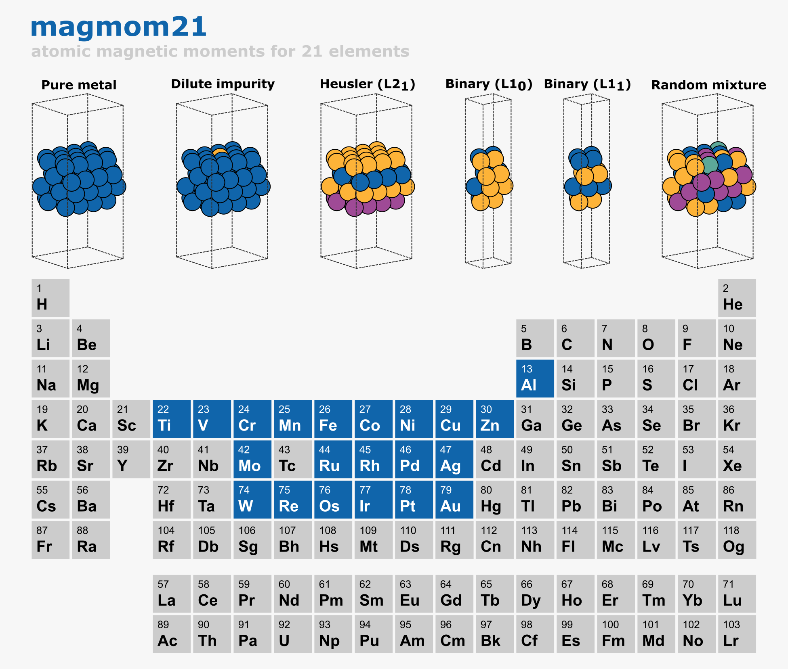

# appliedml-finalproject

Repo for the final project for the Applied Machine Learning 2026 course. Done in collaboration with [RoseTom2026](https://github.com/RoseTom2026) and [kkragj](https://github.com/kkragj). 

Graph neural networks have been trained to predict the per-atom magnetic moment of metal alloy slabs, to warm-start spin-polarised DFT calculations. Seeding a GPAW calculation with predicted initial moments lets the SCF converge faster than the default guess. The model is node-level (one prediction per atom, no pooling) and is compared across many message-passing backends. The training data is the magmom21 dataset: DFT per-atom magnetic moments of 21-element FCC, BCC, and HCP alloy slabs.

To clone and run training on a HPC cluster, see [docs/](docs/).

## Project structure

- `models/` - the GNN training pipeline (Slurm: build graphs, train each backend, evaluate)
- `datasets/magmom21/` - per-atom magnetic moments of metal alloy slabs, the training data
- `applications/` - example use: predict initial moments for a slab to speed up a GPAW calculation
- `tutorial/` - standalone intro to GNNs (a work-function regression notebook)
- `docs/` - step-by-step guide to clone and run training on the cluster
- `requirements.txt` - pipeline dependencies
